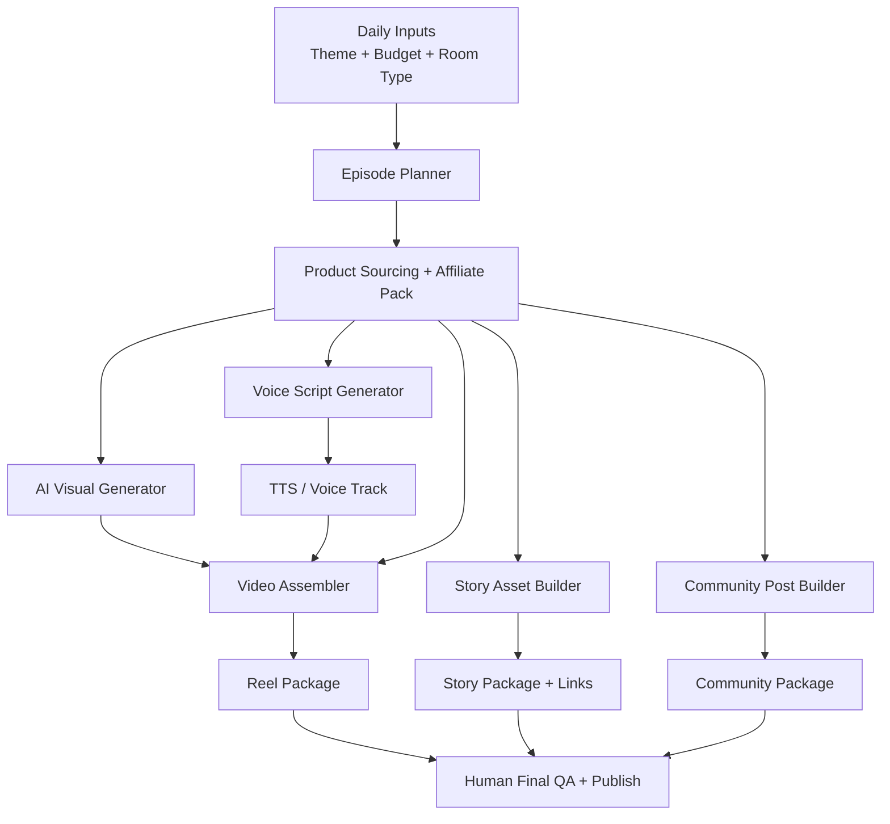
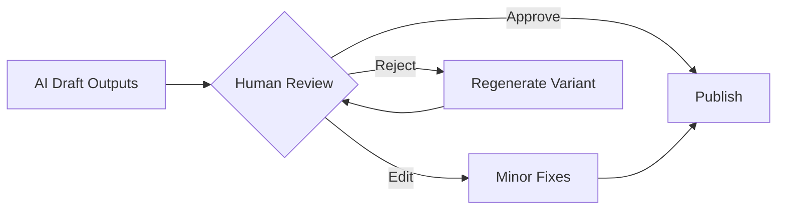

# HackMyApartment — Workflow & Design Diagrams

## End-to-End Flow

```mermaid
flowchart TD
    A[Daily Inputs\nTheme + Budget + Room Type] --> B[Episode Planner]
    B --> C[Product Sourcing + Affiliate Pack]
    C --> D[AI Visual Generator]
    C --> E[Voice Script Generator]
    E --> F[TTS / Voice Track]
    D --> G[Video Assembler]
    F --> G
    C --> G
    G --> H[Reel Package]
    C --> I[Story Asset Builder]
    I --> J[Story Package + Links]
    C --> K[Community Post Builder]
    K --> L[Community Package]
    H --> M[Human Final QA + Publish]
    J --> M
    L --> M
```

## Human-in-the-loop control points

```mermaid
flowchart LR
    A[AI Draft Outputs] --> B{Human Review}
    B -->|Approve| C[Publish]
    B -->|Edit| D[Minor Fixes]
    D --> C
    B -->|Reject| E[Regenerate Variant]
    E --> B
```

## Time Compression Model

```mermaid
gantt
    title Daily pipeline time (minutes)
    dateFormat X
    axisFormat %s

    section Manual
    Planning            :done, m1, 0, 30
    Product sourcing    :done, m2, 30, 60
    Script + voice      :done, m3, 90, 30
    Video edit          :done, m4, 120, 60
    Posting prep        :done, m5, 180, 30

    section Automated v1
    Planning            :active, a1, 0, 8
    Product ops         :active, a2, 8, 20
    Script + voice      :active, a3, 28, 10
    Video assembly      :active, a4, 38, 15
    Posting prep        :active, a5, 53, 10
```
